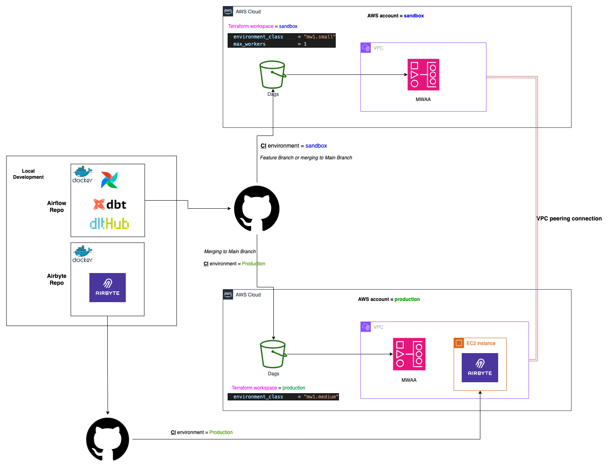

## Overview

This document outlines the approach to set up a robust environment structure for our data platform operations. The primary objective is to enable safe, isolated testing and development of **Airflow DAGs**, **dbt models**, and data ingestion processes, while ensuring reliable and scalable production workflows.

## Background

Our current stack includes:

- **Data Ingestion:** Airbyte, dlt.
- **Orchestration:** Airflow, deployed via AWS MWAA.
- **Data Transformation:** dbt.
- **AWS Services:** S3, ECS, EC2, and Fargate.
- **Version Control and CI/CD:** GitHub and GitHub Actions.

### Current Challenges:
- Testing of DAGs and dbt models occurs directly in production, creating risks.
- No isolated development environment to safely test changes or debug issues.

---

## Proposed Solution: Environment Structure

To address these challenges, we propose a **three-tier environment setup**:

1. **Local Development Environment**
2. **AWS Sandbox Environment**
3. **AWS Production Environment**

### 1. **Local Development Environment**
   - **Purpose:** Allow developers to prototype and test changes in a controlled local setup.
   - **Components:**
     - Local Airflow setup using Docker.
     - dbt setup running in the Airflow project.
     - Local Airbyte instance for connector testing.
   - **Benefits:**
     - Fast feedback loop for development.
     - No dependency on cloud resources for early-stage debugging.
     - Cost-effective for prototyping.

#### Example Local Setup:

#### Local Workflow:

   * Develop and validate DAGs in the ./dags directory.
   * Test dbt models against a lightweight local database.
   * Integrate Airbyte connectors and dbt pipleines into Airflow dags.


#### Airbyte

To set up **Airbyte** for local development:

1. **Install `abctl`**:
   - Run:  
     `curl -LsfS https://get.airbyte.com | bash -`
2. **Run Airbyte**:  
   Ensure Docker Desktop is running, then execute:  
   `abctl local install`
3. **Access**:  
   Visit `http://localhost:8000` to configure your conectors.
4. **Move Data**:  
   Set up sources, destinations, and connections as described in the Airbyte documentation.


####  Airflow

To get Airflow up and running:

```bash
# Initialize Airflow for the first time
docker-compose up airflow-init

# Start the services
docker-compose up -d

# Check the status
docker-compose ps
```

 > Once Airflow is running, you can access the Airflow UI:

   * Go to `http://localhost:8080` in your browser.
   * Log in with the following credentials:
      - **Username**: `admin`
      - **Password**: `admin`

---

### 2. **AWS Sandbox Environment**
   - **Purpose:** Provide a cloud-based testing/staging environment that mimics production, ensuring isolated, end-to-end testing.
   - **Components:**
     - **MWAA:** Small instance to run Airflow for testing DAGs and orchestration workflows.
     - **Airbyte Deployment:** 
       - **Preferred Option (Cost-Effective):** Use a **centralized Airbyte deployment** on ECS (in production) with connectors for both sandbox and production. 
       - Alternatively, deploy **Airbyte in the sandbox environment** for complete isolation but at a higher cost.
       - Another option is to leverage **Airbyte Cloud** for flexible, managed ingestion workflows.
     - **dbt**
       - Currently, dbt tasks are executed directly by Airflow workers in the sandbox environment.
       - Future improvement: Deploy dbt as ECS tasks and trigger them via Airflow for better scalability and separation of concerns.
   - **Networking:**
     - Configure **VPC peering** between sandbox and production for shared access to the central Airbyte deployment.
     - Tight IAM policies to ensure controlled access to production resources.
   - **Benefits:**
     - Ensures reliable, isolated testing without impacting production.
     - Cost optimization by centralizing Airbyte, avoiding duplication of resources.

---

### 3. **AWS Production Environment**
   - **Purpose:** Host live, production workflows with high reliability and scalability.
   - **Components:**
     - **MWAA:** Medium instance size to handle production-scale orchestration.
     - **Airbyte Deployment:**
       - Deployed on **ECS** with autoscaling to support production workflows.
       - Supports connectors shared with the sandbox environment for efficiency.
     - **dbt**
       - Currently, dbt tasks are executed directly by Airflow workers in the Production environment.
       - Future improvement: Deploy dbt as ECS tasks and trigger them via Airflow for better scalability and separation of concerns.
   - **Networking:**
     - No direct access from sandbox to production except through VPC peering with strict IAM controls.

---

## Deployment Strategy

1. **Local to Sandbox**: Developers push changes to a development branch in GitHub, triggering GitHub Actions for CI/CD. This deploys changes to the sandbox environment for integration testing.
2. **Sandbox to Production**: After successful testing in the sandbox environment, changes are reviewed and merged to the main branch, triggering another GitHub Actions workflow for deployment to production.

Example of the MWAA workflow:
```yaml
name: Deploy

on:
  workflow_call:
    inputs:
      environment:
        required: true
        type: string

permissions:
    id-token: write
    contents: read

jobs:
  deploy:
    runs-on: ubuntu-latest
    environment: ${{ inputs.environment }}
    steps:
      - name: Clone Repo
        uses: actions/checkout@v2

      - name: Configure AWS Credentials
        uses: aws-actions/configure-aws-credentials@v4
        with:
          role-to-assume: ${{ secrets.AWS_GITHUB_ACTION_AIRFLOW_ROLE }}
          aws-region: ${{ secrets.AWS_REGION }}

      - name: Sync Airflow files to the MWAA S3 bucket with the AWS CLI
        run: sh .github/scripts/upload_to_s3.sh
        env:
          AIRFLOW_BUCKET_NAME: ${{ vars.AIRFLOW_BUCKET_NAME }}
```

---

## Data platform Architecture Diagram



## Benefits of the Proposed Solution

1. **Cost Optimization:** 
   - Centralized Airbyte for shared connectors avoids redundant infrastructure.
   - Lightweight instances in the sandbox environment reduce costs while enabling comprehensive testing.
2. **Isolation:** Sandbox environment ensures safe testing without affecting production.
3. **Scalability:** Leveraging AWS-managed services like MWAA, ECS, and S3 ensures reliability and scalability.
4. **Developer Productivity:** Efficient CI/CD pipelines streamline testing and deployment, reducing time-to-production.

---